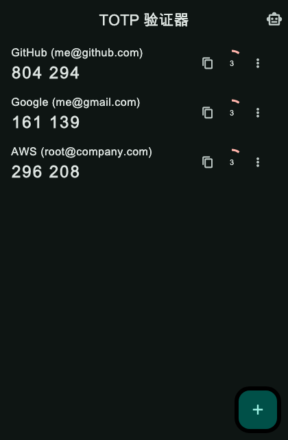
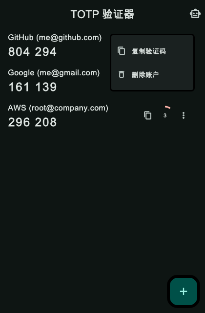
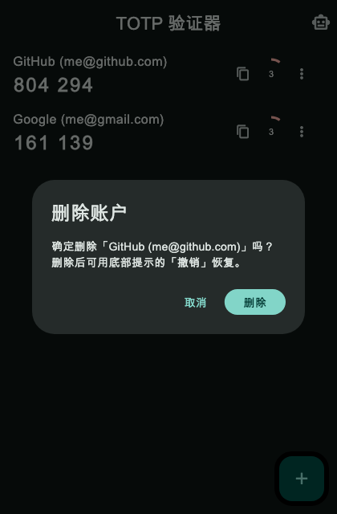
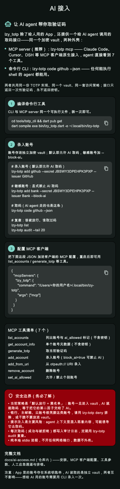

# lzy_totp — 自制 TOTP 验证器

Flutter 编写的两步验证（2FA）应用，对标 andOTP / Google Authenticator 的核心功能。
**一套代码同时构建 Android 与 macOS 两端。**

## 功能

- **扫码添加**：识别 `otpauth://totp/...` 二维码（mobile_scanner + ML Kit，仅 Android/iOS）
- **手动添加**：输入 Base32 密钥，支持位数（6/8）、周期（30/60s）、算法（SHA1/SHA256/SHA512）
  （桌面端自动聚焦密钥框，打开即 Cmd+V 粘贴）
- **TOTP 计算**：RFC 6238，测试向量全覆盖（SHA1/SHA256/SHA512）
- **加密存储**：密钥经 flutter_secure_storage 加密落盘
  - Android：AES-GCM + RSA 密钥包裹（密钥由 Android Keystore 保管）
  - iOS：Keychain
  - macOS：Keychain（传统 keychain，`usesDataProtectionKeychain: false`，无需签名 entitlement）
- **首页**：验证码实时刷新、倒计时圆环、点击复制、左滑删除
  （桌面端列表项额外提供显式复制按钮）
- **删除账户**：每条账户都有明确的删除入口——行尾 `⋮` 菜单（桌面端不用左滑）、长按弹操作面板、
  以及原有左滑；删除前二次确认，删完可点「撤销」恢复
- **AI 接入说明**：App 内「AI 接入」页给出三步接入、可复制的 MCP 配置 JSON 与 CLI 命令、工具清单与安全提示

## 平台支持

| 平台 | 状态 | 扫码添加 |
|---|---|---|
| Android | ✅ | 支持 |
| macOS | ✅ | 不支持（自动隐藏入口，直接进手动粘贴页） |
| iOS | 工程已生成 | 支持 |

平台差异集中判断于 `lib/utils/platform_utils.dart`（`AppPlatform.isDesktop` / `supportsScan`），
业务逻辑两端完全共用。

## 界面

<p>
  
  
  
</p>

<p>
  
</p>

截图由 `tool/screenshots/capture_test.dart` 用真实 widget 树渲染生成（不依赖屏幕录制权限，
也不需要跑起 GUI）：

```bash
flutter test tool/screenshots/capture_test.dart --update-goldens   # 产物写入 docs/images/
```

## 项目结构

```
lib/                              # Flutter App（Android + macOS）
  main.dart                       # 入口，深色主题
  models/account.dart             # → 转发到 totp_core 的账户模型
  services/totp_service.dart      # → 转发到 totp_core 的 TOTP 计算
  services/storage_service.dart   # 加密本地存储（按平台选择 Keychain 策略）
  utils/platform_utils.dart       # 平台能力判断
  pages/account_list_page.dart    # 首页列表（复制 / 删除 / 撤销）
  pages/ai_access_page.dart       # AI 接入说明页（可复制 MCP 配置与 CLI 命令）
  pages/scan_page.dart            # 扫码页
  pages/add_account_page.dart     # 手动添加页
packages/totp_core/               # 共享内核（纯 Dart，App / CLI / MCP 共用）
  lib/src/totp.dart               # TOTP 计算（RFC 6238）
  lib/src/account.dart            # 账户模型 + otpauth:// 解析 + aiAllowed 标记
  lib/src/vault.dart              # AES-256-GCM 加密 vault
  lib/src/policy.dart             # AI 访问策略（默认放行 + deny 黑名单）
  lib/src/audit.dart              # 审计日志
  lib/src/paths.dart              # 数据目录解析
tools/totp_cli/                   # 命令行 + MCP server
  bin/lzy_totp.dart               # CLI 入口
  lib/cli.dart                    # 命令实现
  lib/mcp_server.dart             # MCP stdio server（7 个工具）
docs/ai-access.md                 # AI agent 接入指南：架构、快速开始、客户端配置、安全边界、排错
docs/images/                      # 界面截图（由 tool/screenshots 生成）
tool/screenshots/capture_test.dart # 截图生成器（不在 test/ 下，flutter test 不会自动跑）
test/totp_test.dart               # RFC 6238 向量 + URI 解析 + 序列化测试
test/widget_test.dart             # 启动冒烟测试
test/account_list_test.dart       # 账户删除（菜单 / 长按 / 左滑 + 确认 + 撤销）
test/ai_access_page_test.dart     # AI 接入页内容与复制
```

## 让 AI agent 接入 lzy_totp

除了给人用的 App，本仓库还提供一个给 AI agent 调用的取码接口——MCP server 与 CLI 两种外壳、
同一个加密 vault、同一套「默认放行 + 黑名单」策略：

```bash
# 1. 装一次
cd tools/totp_cli && dart pub get
dart compile exe bin/lzy_totp.dart -o ~/.local/bin/lzy-totp

# 2. 录入账号（默认即允许 AI 取码，敏感账号加 --block-ai）
lzy-totp add github --secret JBSWY3DPEHPK3PXP --issuer GitHub

# 3. 取码 / 黑名单 / 审计
lzy-totp code github --json
lzy-totp deny "Bank (me@x.com)"
lzy-totp audit --tail 20

# 4. 作为 MCP server 运行（stdio，不开端口）
lzy-totp mcp
```

接入 MCP 客户端只需一段配置（Claude Desktop / Cursor / Windsurf / Cline 通用）：

```json
{
  "mcpServers": {
    "lzy_totp": {
      "command": "/Users/<你的用户名>/.local/bin/lzy-totp",
      "args": ["mcp"]
    }
  }
}
```

Claude Code 一行搞定：`claude mcp add lzy_totp -- ~/.local/bin/lzy-totp mcp`；
DSH 用 `@deepseek-ai/dsh-mcp-client`（工具名形如 `mcp__lzy_totp__generate_totp`）——
完整配置见 [docs/ai-access.md](docs/ai-access.md)，App 首页右上角的机器人图标也内置了同样内容的
「AI 接入」说明页（配置与命令可一键复制，见[界面](#界面)最后一张截图）。

核心安全设计：**只返回一次性验证码，永不返回密钥**；默认放行、可用 `deny` 把个别账号（银行、主邮箱等）
排除在 AI 之外；每次取码（含被拒绝的）都写审计日志。App 的账号存在系统钥匙串，
与 AI 读取的 vault 相互独立——想给 AI 用的账号需要用 CLI 录入一次。

## 构建

```bash
# 开发调试
flutter run                 # 自动选择设备
flutter run -d macos        # 指定 macOS 桌面端

# Release APK（按 CPU 架构拆分，单包更小）
flutter build apk --release --split-per-abi

# 单一大包
flutter build apk --release

# macOS 桌面端
flutter build macos --release

# 打包 macOS 安装镜像（.dmg，内含 Applications 快捷方式，可拖拽安装）
mkdir -p /tmp/dmg_stage
cp -R build/macos/Build/Products/Release/lzy_totp.app /tmp/dmg_stage/
ln -s /Applications /tmp/dmg_stage/Applications
hdiutil create -volname "lzy_totp 1.0.1" -srcfolder /tmp/dmg_stage \
  -ov -format UDZO dist/lzy_totp-1.0.1-macos.dmg
```

APK 产物在 `build/app/outputs/flutter-apk/`，Release 已开启 R8 代码压缩与资源瘦身
（`android/app/build.gradle.kts` + `proguard-rules.pro`）。

macOS 产物在 `build/macos/Build/Products/Release/lzy_totp.app`（约 43.3 MB），
双击即可运行；窗口默认 420×640、最小 360×480。

### 实测体积（Flutter 3.44.4，split-per-abi release）

| 架构 | 大小 |
|---|---|
| arm64-v8a（主流手机） | **18.7 MB** |
| armeabi-v7a（旧手机） | 16.0 MB |
| x86_64（模拟器） | 20.2 MB |

体积大头是 Flutter 引擎（libflutter.so ≈ 11.6MB + Dart AOT ≈ 5MB），属正常水平。

### 扫码模型：bundled ↔ unbundled

当前使用 **unbundled ML Kit**（`android/gradle.properties` 里
`dev.steenbakker.mobile_scanner.useUnbundled=true`），扫码模型首次使用时
经 Google Play Services 在线下载，APK 省约 6MB。
**代价：无 GMS 的手机（部分国产 ROM / 华为）扫码可能不可用。**
删掉该行改回 bundled 即可离线可用，APK 涨到约 24.8MB。

### 国内网络构建

- `android/build.gradle.kts` 与 `android/settings.gradle.kts` 已将
  阿里云 Maven 镜像置于官方源之前；
- 构建时设置环境变量走 Flutter 国内镜像下载引擎产物：
  `export FLUTTER_STORAGE_BASE_URL=https://storage.flutter-io.cn`
- 若 Gradle 拉依赖出现 TLS 握手失败（`Remote host terminated the handshake`），
  在 `~/.gradle/gradle.properties` 配置代理：
  ```properties
  systemProp.http.proxyHost=127.0.0.1
  systemProp.http.proxyPort=7897
  systemProp.https.proxyHost=127.0.0.1
  systemProp.https.proxyPort=7897
  ```

## 测试

```bash
# Flutter App
flutter analyze && flutter test

# 共享内核（TOTP 向量、加密 vault、默认放行策略、审计）
cd packages/totp_core && dart test

# CLI 与 MCP server
cd tools/totp_cli && dart test
```

## 发布签名

### Android（正式密钥）

发布构建从 `android/key.properties` 读取签名配置（该文件与 keystore **均不入库**）：

```properties
storePassword=<密码>
keyPassword=<密码>
keyAlias=lzy_totp
storeFile=/Users/<你>/keystores/lzy_totp-release.jks
```

keystore 位于仓库之外（`~/keystores/lzy_totp-release.jks`），密码备份在同目录的
`lzy_totp-keystore-info.txt`。**请务必备份这两个文件**：密钥丢失后将无法为已安装用户
发布升级包。

`android/app/build.gradle.kts` 里做了回退处理——`key.properties` 不存在时自动使用
debug 签名，所以直接 clone 本仓库的人也能 `flutter build apk`，无需你的密钥。

验证签名（Android SDK build-tools）：

```bash
apksigner verify --print-certs build/app/outputs/flutter-apk/app-arm64-v8a-release.apk
# 应显示 CN=lzy_totp ... SHA-256: 25ad01d9...c88f95
```

⚠️ v1.0.0 的旧 APK 使用 debug 密钥签名，与 v1.0.1 起使用的正式密钥**签名不同**，
从旧版升级需要先卸载再安装。

### macOS（ad-hoc 签名）

macOS 产物未做 Apple Developer ID 签名与公证（`Signature=adhoc`），首次打开需绕过
Gatekeeper：

```bash
xattr -dr com.apple.quarantine /Applications/lzy_totp.app
```

或右键点击 App 选择「打开」。要做正式分发需申请 Apple Developer 账号并配置
Developer ID 证书 + 公证流程。
